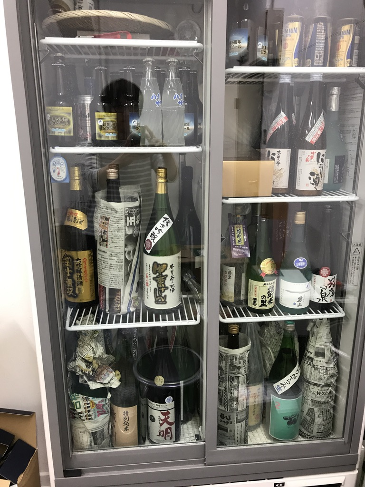
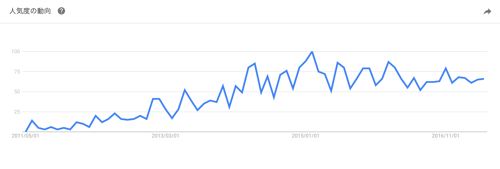
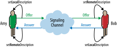
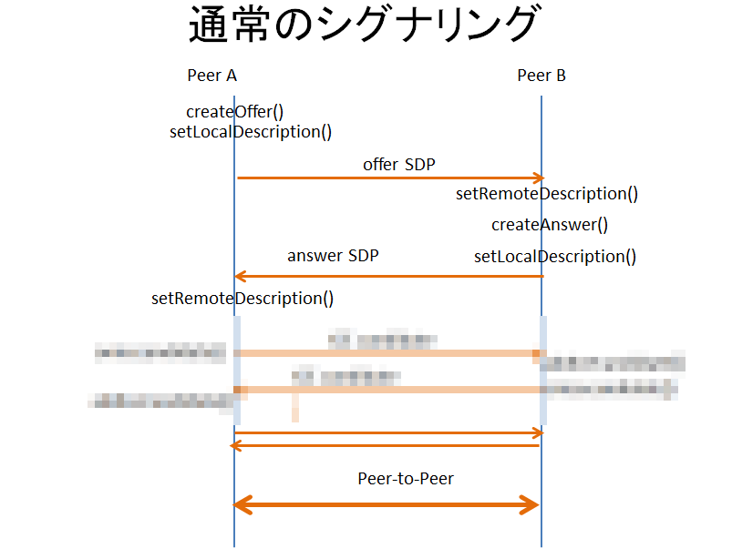
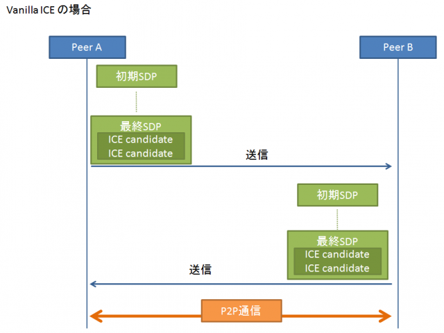
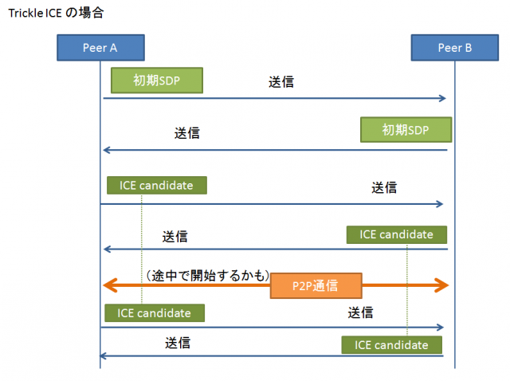
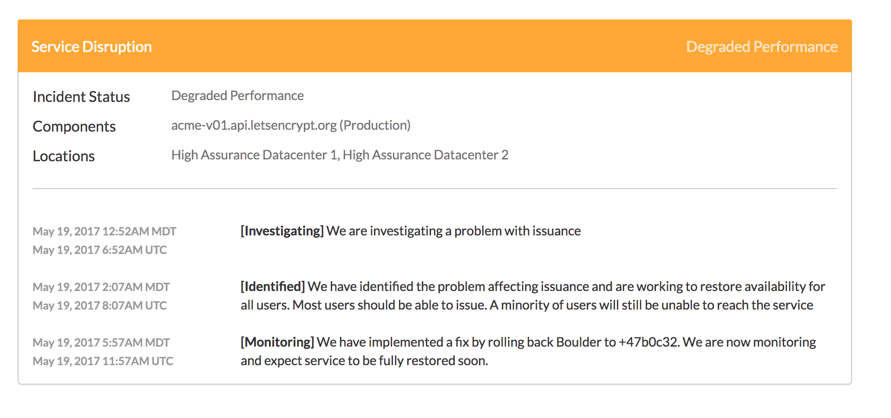

<!--top-->
# はじめてのWebRTC
## (ゆるくWebRTCを学ぼう！)

2017/05/20 polidogとネットワーク周りを勉強しよう 　

[@polidog🐘](https://twitter.com/polidog)

-----


* [@polidog](https://twitter.com/polidog)
* [tavii.com Inc](http://tavii.com)
* PHPer, フロントエンド少し書きます。
* 清水区出身


-----

## タビィコム




-----
<!--cm-->
## 宣伝

Symfony Meetupを東京で開催しています。
OOPとかDDDとかその辺興味ある方はぜひ！

-----

## はじめに

なぜWebRTCに興味を持ったのか？

-----
<!--js-->
## JSで簡単にコミュニケーションツールつくれるから

-----
## 今日話すこと

* WebRTCとは？
* MediaStream
* RTCPeerConnection
* NATを超えるために
* データチャネル
* PeerJSとかSkywayについて

-----
<!--section-->
# WebRTCとは？

-----

## WebRTCとは？

- リアルタイムコミュニケーション用のAPI
- ブラウザのみでビデオチャットやファイル共有が可能

-----



* 2011年ぐらいから騒がれてはじめている？
* 最近はあまり話し聞かない気もする・・・。

-----

## 使われているサービス

- [Google Hangout](https://hangouts.google.com/)
- [Slack](https://https://slack.com/)(ビデオチャット部分)
- [appear.in](https://appear.in/)


ビデオチャット関連のサービスはだいたいWebRTC採用されている

-----

## 対応ブラウザ

- Chrome
- FireFox
- Opera
- Edge

-----
## WebRTCの主なAPI

- MediaStream API: 音声や動画を扱うためのAPI
- RTCPeerConnection API: 音声や動画の通信のためのAPI
- RTCDataChanel API : データ通信用のAPI


-----
<!--section-->
# MediaStream

-----

# MediaStream API

- 動画、音声をストリームとして扱うJavaScript API
- getUserMediaをつかってMediaStreamを取得する
- videoタグに渡せば動画再生するし、RTCPeerConnectionに渡すこともできる

-----


-----
## <a href="demo/mediastream.html" target="blacnk" >demo</a>


-----
<!--code-->
## コードを確認してみる

``` JavaScript
var config = {
  audio: false,
  video:  true
}

navigator.mediaDevices.getUserMedia(config)
  .then(function(stream){
    var video = document.getElementById('video-display');
    video.src = window.URL.createObjectURL(stream);
  }).catch(function(error){
    console.log(error)
  }
```


-----

## たった数行でvideo表示できる

-----

## navigator.mediaDevices

- 最近のブラウザだとnavigator.mediaDevices.getUserMedia()を使えばよい
- 過去はベンダーごとprefixついてた。
- しかもPromiseではない。
- Firefox47, Chrome51以降ならnavigator.mediaDevices

-----
<!--code-->

``` JavaScript
navigator.getUserMedia  = navigator.getUserMedia || navigator.mozGetUserMedia || navigator.msGetUserMedia　|| navigator.webkitGetUserMedia;

function getUserMedia(options) {

  if ('getUserMedia' in navigator.mediaDevices) {
    return navigator.mediaDevices.getUserMedia(options)
  }

  return new Promise(function(resolve, reject){
    navigator.getUserMedia(options, resolve, reject)
  });

}

```

-----

ちなみに最新のChromeだとここのデモとか動かない・・・。
<a href="https://www.html5rocks.com/ja/tutorials/getusermedia/intro/" target="_blank">HTML5 での映像と音声の取得</a>


-----
<!--section-->
# RTCPeerConnection

-----

## RTCPeerConnection

- RTCPeerConnectionは、P2Pの接続の確立、接続の維持のための処理を提供する

-----


-----

## シグナリング

Peer-to-Peer通信を始める前に、お互いの情報を交換するための処理


-----

## SDP(Session Description Protocol)

P2Pの接続情報を交換するためのプロトコル
- セッションが含む音声、動画の形式
- IPアドレス、ポート番号
- 通信で使用される帯域

-----

## demo

-----


参考: [WebRTCの簡易シグナリング](http://qiita.com/massie_g/items/f5baf316652bbc6fcef1)

-----

<!--section-->
# NATを超えるために

-----
## ICE

NAT超えるために必要なもの

- RTCPeeerConnectionはICEエージェントを持つ
- ICEエージェントはIPアドレスとポートの組合わせ(候補)を収集する
　

-----
## STAN


- グローバルなIPとポートを返すサーバ
- STUNサーバについてはパブリックに公開されているサービスがいくつかある
- もちろん自前で立てても大丈夫

```
stun.l.google.com:19302 // google
stun.services.mozilla.com:3478 / Mozilla
stun.skyway.io:3478 / NTTCommunications
```

-----


<a href="https://html5experts.jp/mganeko/5554/" target="_blank">壁を越えろ！WebRTCでNAT/Firewallを越えて通信しよう</a>

-----

## TURN

Peer-to-Peer通信ができないときに代わりにリレーするサーバ

-----


<a href="https://html5experts.jp/mganeko/5554/" target="_blank">壁を越えろ！WebRTCでNAT/Firewallを越えて通信しよう</a>

-----

## ICEエージェント流れ

1. 自身のIPアドレスをOSに確認
2. 外部のSTUNサーバに問い合わせグローバルIPとポートを取得する
3. P2P接続に失敗した場合にTURNサーバを利用してリレーする

-----

## Trickle ICE

- ICEの拡張
- ICEの候補が見つかったらすぐに相手と交換する
- 相手と交換できたら、その情報を使ってすぐに接続試行する


-----



[WebRTCハンズオン 概要編](http://qiita.com/massie_g/items/916694413353a3293f73)

-----



[WebRTCハンズオン 概要編](http://qiita.com/massie_g/items/916694413353a3293f73)

-----

## DEMO

-----

## を用意しようとおもったのですが・・・

-----



-----

## Let's Encriptが使えない・・・
WebRTCはSSLじゃないと・・・

DEMOはまた今度・・・

-----
<!--section-->

# データチャネル

-----

## RTCDataChannel

- 双方向のアプリケーションデータのやり取りができる
- WebSocketに似ている
- RTCPeerConnectionを確立すると利用できる
- テキスト、バイナリデータをやりとりできる

-----

## DEMO

-----
<!--section-->
# PeerJSとかSkywayについて

-----
## PeerJS

WebRTCを活用したアプリケーションを開発できるようにするためのJavaScriptライブラリ。

-----

## SkyWay

Web開発者が高度な知識の習得や環境の整備をすることなく、WebRTCを活用したアプリケーションを開発できるs

----

## Skywayを使ったDEMO

-----

# 最後に

-----

## WebRTCを学んでみた感想

- WebRTCは奥が深い。まだまだ学ぶことがたくさんある
- ネットワークのを覚えるための入り口として良さそう
- 楽しい
- ハイパフォーマンスブラウザネットワーキングは良い本

-----

## おしまい
